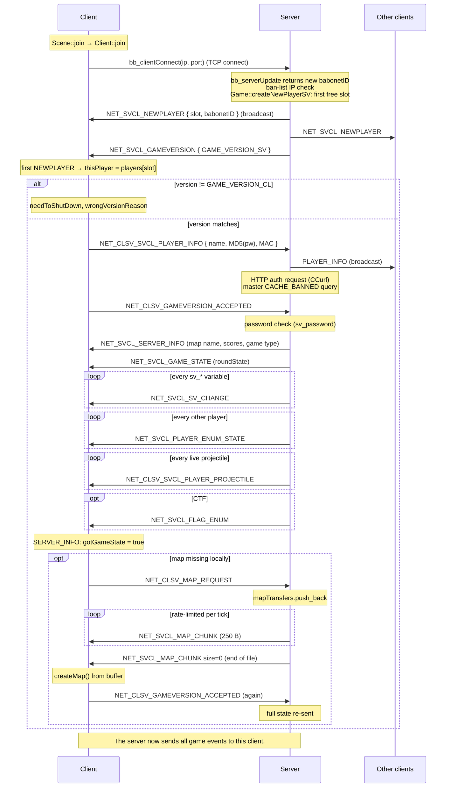

# 03 — Data Flow

> How data moves between client, server, master server and disk. All steps traced through the actual call sites.

---

## 1. Connection handshake



Evidence, in order:

1. `Client::join` stores password (truncated to 15) and calls `bb_clientConnect`: [VERIFY: BaboViolent2/Code/Client.cpp:838-846]
2. Server sees a positive id from `bb_serverUpdate`, checks ban list by IP, creates the player: [VERIFY: BaboViolent2/Code/Server.cpp:444-473]
3. `createNewPlayerSV` takes the first free slot below `sv_maxPlayer`, broadcasts `NEWPLAYER`, unicasts `GAMEVERSION`: [VERIFY: BaboViolent2/Code/Game.cpp:1644-1673]
4. Before the game state arrives, the client ignores everything except NEWPLAYER, GAMEVERSION, SERVER_INFO, PING and MAP_CHUNK: [VERIFY: BaboViolent2/Code/ClientRecv.cpp:84-94]
5. First `NEWPLAYER` received becomes `thisPlayer`: [VERIFY: BaboViolent2/Code/ClientRecv.cpp:239-251]
6. Version check, then `PLAYER_INFO` (with MAC and MD5 password) and `GAMEVERSION_ACCEPTED`: [VERIFY: BaboViolent2/Code/ClientRecv.cpp:252-299]. Since `46c8572` both are sent by `Client::sendJoinHandshake()`. If `GAMEVERSION` arrives before the client's own `NEWPLAYER`, the reply is deferred until that slot exists (`pendingVersionAccept`). `PING` is answered before the step-4 filter.
7. Server `PLAYER_INFO` handler: rename, broadcast, HTTP auth, master ban query, local cache: [VERIFY: BaboViolent2/Code/ServerRecv.cpp:439-535]
8. Server `GAMEVERSION_ACCEPTED` handler: password check, then state dump: [VERIFY: BaboViolent2/Code/ServerRecv.cpp:305-438]
9. Client `SERVER_INFO` handler: sets `gotGameState`; if no map, requests download: [VERIFY: BaboViolent2/Code/ClientRecv.cpp:342-378]
10. Server map transfer loop (250-byte chunks, `sv_maxUploadRate` KB/s budget split over 30 ticks): [VERIFY: BaboViolent2/Code/Server.cpp:1340-1388]
11. Client assembles chunks into `mapBuffer`; on `size == 0` builds the map and re-sends `GAMEVERSION_ACCEPTED`: [VERIFY: BaboViolent2/Code/ClientRecv.cpp:98-131]

> The listen-server client (`isServer`) never downloads: it calls `createMap()` straight from disk.
> [VERIFY: BaboViolent2/Code/ClientRecv.cpp:355-366]

---

## 2. Per-tick pipelines

### 2.1 Server tick (`Server::update`, 30 Hz)

[VERIFY: BaboViolent2/Code/Server.cpp:566-1392]

```
 1. every 20 s → master->sendGameInfo            (if sv_gamePublic)          :574-579
 2. harvest finished HTTP auth requests → userID                           :582-653
 3. harvest report uploads                                                  :655-674
 4. master ban answers → kick                                               :676-698
 5. [_PRO_] checksum-query timeouts, delayed kicks                          :700-747
 6. updateNet()  (accept / disconnect)                                      :750
 7. map change countdown (10 s) → createMap, broadcast MAP_CHANGE + GAME_STATE :753-798
 8. sv_gameType changed? → resetGameType                                    :801-804
 9. timers; win-condition check per game type → round end + report          :807-995
10. drain bb_serverReceive → recvPacket()                                   :1010-1014
11. ping state machine (every 30 frames), disconnect after 300 frames       :1018-1078
12. max-ping → spectator; idle → spectator; join message                    :1080-1118
13. game->update(delay)   (players, projectiles, voting)                    :1121
14. per-player snapshot fan-out: COORD_FRAME of every other alive player,
    PLAYER_PING, SYNCHRONIZE_TIMER                                          :1124-1225
15. auto-balance timer; CTF / SND mode update                               :1228-1333
16. updateNet() again                                                       :1337
17. map chunk uploads                                                       :1340-1388
```

### 2.2 Client tick (`Client::update`)

1. Vote keys F1/F2 → `NET_CLSV_VOTE`: [VERIFY: BaboViolent2/Code/Client.cpp:176-197]
2. `bb_clientUpdate`: result 1 = error, 2 = server closed → shutdown: [VERIFY: BaboViolent2/Code/Client.cpp:256-273]
3. Drain `bb_clientReceive` → `recvPacket`: [VERIFY: BaboViolent2/Code/Client.cpp:407-410]
4. `game->update(delay)`: [VERIFY: BaboViolent2/Code/Client.cpp:453]

Inside `Game::update` → `Player::update` for the local player:

1. integrate own velocity, apply friction: [VERIFY: BaboViolent2/Code/PlayerUpdate.cpp:252-276]
2. read input (`controlIt`): [VERIFY: BaboViolent2/Code/PlayerUpdate.cpp:282-285]
3. send own `COORD_FRAME` every `max(avgPing, sv_minSendInterval)` frames: [VERIFY: BaboViolent2/Code/PlayerUpdate.cpp:291-315]
4. back in `Game::update`, collide the local player against other babos and the map: [VERIFY: BaboViolent2/Code/Game.cpp:607-633]

Remote players are not integrated; they are interpolated from `netCF0 → netCF1`: [VERIFY: BaboViolent2/Code/PlayerUpdate.cpp:240-247]

---

## 3. Message catalogue

Direction: C→S client to server, S→C server to client, ↔ relayed. "Unicast/broadcast" = what the server does.

### Session & lobby

| ID | Name | Dir | Handler | Notes |
|---|---|---|---|---|
| 101 | `NEWPLAYER` | S→C broadcast | [VERIFY: BaboViolent2/Code/ClientRecv.cpp:239] | slot + babonetID |
| 116 | `GAMEVERSION` | S→C | [VERIFY: BaboViolent2/Code/ClientRecv.cpp:252] | 21000 / 21100 |
| 4 | `GAMEVERSION_ACCEPTED` | C→S | [VERIFY: BaboViolent2/Code/ServerRecv.cpp:305] | carries server password (16 bytes, plaintext) |
| 201 | `PLAYER_INFO` | ↔ | [VERIFY: BaboViolent2/Code/ServerRecv.cpp:439] | name, account user, MD5(password), MAC |
| 102 | `SERVER_INFO` | S→C | [VERIFY: BaboViolent2/Code/ClientRecv.cpp:342] | map name, scores |
| 105 | `PLAYER_ENUM_STATE` | S→C | [VERIFY: BaboViolent2/Code/ClientRecv.cpp:397] | full player record for late joiners |
| 104 | `PLAYER_DISCONNECT` | S→C | [VERIFY: BaboViolent2/Code/ClientRecv.cpp:329] | |
| 209/210 | `MAP_REQUEST` / `MAP_CHUNK` | C→S / S→C | [VERIFY: BaboViolent2/Code/ServerRecv.cpp:45] [VERIFY: BaboViolent2/Code/ClientRecv.cpp:98] | 250-byte chunks |
| 8/211 | `MAP_LIST_REQUEST` / `MAP_LIST` | C→S / S→C | [VERIFY: BaboViolent2/Code/ServerRecv.cpp:1156] | one packet per map |
| 106/1 | `PING` / `PONG` | S→C / C→S | [VERIFY: BaboViolent2/Code/ServerRecv.cpp:653] | RTT measured in frames |
| 107 | `PLAYER_PING` | S→C | [VERIFY: BaboViolent2/Code/ClientRecv.cpp:445] | |
| 109 | `SV_CHANGE` | S→C | [VERIFY: BaboViolent2/Code/ClientRecv.cpp:562] | `"set <var> <value>"` executed on the client |

### Gameplay

| ID | Name | Dir | Handler | Notes |
|---|---|---|---|---|
| 204 | `PLAYER_COORD_FRAME` | ↔ | [VERIFY: BaboViolent2/Code/ServerRecv.cpp:777] [VERIFY: BaboViolent2/Code/ClientRecv.cpp:491] | pos ×100, vel ×10, aim ×100 |
| 2 | `SPAWN_REQUEST` | C→S | [VERIFY: BaboViolent2/Code/ServerRecv.cpp:667] | weapon choice + skin |
| 108 | `PLAYER_SPAWN` | S→C | [VERIFY: BaboViolent2/Code/ClientRecv.cpp:465] | position ×10 |
| 3 | `PLAYER_SHOOT` | C→S | [VERIFY: BaboViolent2/Code/ServerRecv.cpp:944] | hitscan request |
| 110 | `PLAYER_SHOOT` (result) | S→C | [VERIFY: BaboViolent2/Code/ClientRecv.cpp:598] | resolved ray + hit player |
| 206 | `PLAYER_PROJECTILE` | ↔ | [VERIFY: BaboViolent2/Code/ServerRecv.cpp:1025] [VERIFY: BaboViolent2/Code/ClientRecv.cpp:726] | rocket / nade / molotov / pickups |
| 207 | `PLAYER_SHOOT_MELEE` | ↔ | [VERIFY: BaboViolent2/Code/ServerRecv.cpp:139] | knives, nuke, shield, minibot |
| 111 | `DELETE_PROJECTILE` | S→C | [VERIFY: BaboViolent2/Code/ClientRecv.cpp:790] | by uniqueID |
| 113 | `EXPLOSION` | S→C | [VERIFY: BaboViolent2/Code/ClientRecv.cpp:835] | visual; damage is server-side |
| 114 | `PLAYER_HIT` | S→C | [VERIFY: BaboViolent2/Code/ClientRecv.cpp:854] | `damage` field carries **remaining life** |
| 5/124 | `PICKUP_REQUEST` / `PICKUP_ITEM` | C→S / S→C | [VERIFY: BaboViolent2/Code/ServerRecv.cpp:1103] [VERIFY: BaboViolent2/Code/ClientRecv.cpp:1145] | weapon swap |
| 125 | `FLAME_STICK_TO_PLAYER` | S→C | [VERIFY: BaboViolent2/Code/ClientRecv.cpp:814] | |
| 115 | `PLAY_SOUND` | C→S relayed | [VERIFY: BaboViolent2/Code/ServerRecv.cpp:537-551] | relayed verbatim to everyone else |

### Game flow, chat, admin

| ID | Name | Dir | Handler |
|---|---|---|---|
| 117 | `SYNCHRONIZE_TIMER` | S→C | [VERIFY: BaboViolent2/Code/ClientRecv.cpp:921] |
| 118/119/120 | `CHANGE_FLAG_STATE` / `DROP_FLAG` / `FLAG_ENUM` | S→C | [VERIFY: BaboViolent2/Code/ClientRecv.cpp:933] [VERIFY: BaboViolent2/Code/ClientRecv.cpp:1052] [VERIFY: BaboViolent2/Code/ClientRecv.cpp:1064] |
| 121/122/123 | `GAME_STATE` / `CHANGE_GAME_TYPE` / `MAP_CHANGE` | S→C | [VERIFY: BaboViolent2/Code/ClientRecv.cpp:1077] [VERIFY: BaboViolent2/Code/ClientRecv.cpp:1109] [VERIFY: BaboViolent2/Code/ClientRecv.cpp:1116] |
| 202 | `CHAT` | ↔ | [VERIFY: BaboViolent2/Code/ServerRecv.cpp:552] |
| 203 | `TEAM_REQUEST` | ↔ | [VERIFY: BaboViolent2/Code/ServerRecv.cpp:628] |
| 205 | `PLAYER_CHANGE_NAME` | ↔ | [VERIFY: BaboViolent2/Code/ServerRecv.cpp:920] |
| 208/7/130/131 | vote request / vote / update / result | ↔ | [VERIFY: BaboViolent2/Code/ServerRecv.cpp:94] [VERIFY: BaboViolent2/Code/ServerRecv.cpp:60] |
| 6/127 | `ADMIN_REQUEST` / `ADMIN_ACCEPTED` | C→S / S→C | [VERIFY: BaboViolent2/Code/ServerRecv.cpp:186] |
| 126 | `CONSOLE` | ↔ | [VERIFY: BaboViolent2/Code/ServerRecv.cpp:163] (admin command in, console text out) |

---

## 4. Snapshot fan-out rate

The server does **not** send a fixed-rate world snapshot. Each *receiving* player `i` has a counter; when it reaches `max(avgPing_i, sv_minSendInterval + nbPlayers/8)` frames, player `i` gets one `COORD_FRAME` for every other alive player plus their pings and a timer sync.
[VERIFY: BaboViolent2/Code/Server.cpp:1132-1135] [VERIFY: BaboViolent2/Code/Server.cpp:1138-1191] [VERIFY: BaboViolent2/Code/Server.cpp:1218-1222]

- `avgPing` is in frames (≈33 ms each), so a 100 ms player gets updates roughly every 3 frames (10 Hz), and a 300 ms player every 9 frames.
- The client uses the same rule for its own uploads: [VERIFY: BaboViolent2/Code/PlayerUpdate.cpp:292]
- `sv_minSendInterval` is registered with range 0..5, default 2: [VERIFY: BaboViolent2/Code/GameVar.cpp:346]

Cost per server tick when every player is due: `O(P²)` coord-frame messages for `P` players (32² = 1024 small messages).

---

## 5. Transport reality: everything is TCP

`Server::host()` calls `bb_serverCreate(false, MAX_PLAYER, sv_port)`; the first argument is `UDPenabled`.
[VERIFY: BaboViolent2/Code/Server.cpp:153] [VERIFY: Engine/babonet/Code/baboNet.h:119]

In `cServer::Send`, the protocol flag only has an effect when `UDPenabled` is true:

```cpp
C->CreatePacket(new cPacket(...), UDPenabled ? (protocol ? true : false) : false);
```
[VERIFY: Engine/babonet/Code/cServer.cpp:887]

So every `bb_serverSend(..., NET_UDP)` in the game code (coord frames, pings, timer sync) actually travels over the reliable TCP stream. That explains why the anti-lag design leans on `avgPing`-scaled send intervals: the stream is ordered and reliable, and anything sent too often just queues up behind head-of-line blocking.

The UDP socket bound by `bb_peerBindPort(sv_port)` is used for P2P traffic: LAN discovery broadcast and remote admin.
[VERIFY: BaboViolent2/Code/Server.cpp:183] [VERIFY: BaboViolent2/Code/CMaster.cpp:291-295] [VERIFY: BaboViolent2/Code/CMaster.cpp:372]

---

## 6. External data flows

| Flow | Transport | Evidence |
|---|---|---|
| Account authentication | HTTP POST via libcurl to `db_accountServer` (action=auth, username, MD5 password, server name/ip/port) | [VERIFY: BaboViolent2/Code/ServerRecv.cpp:469-483] |
| Auth answer → `userID` | response body parsed as int | [VERIFY: BaboViolent2/Code/Server.cpp:601-609] |
| Match report | base64 report POSTed to `reportUploadURLs` on round end (`sv_report`) | [VERIFY: BaboViolent2/Code/Server.cpp:965-985] |
| Server listing | `master->sendGameInfo` every 20 s | [VERIFY: BaboViolent2/Code/Server.cpp:574-579] [VERIFY: BaboViolent2/Code/Server.cpp:543-547] |
| Global ban query | `CACHE_BANNED {ID, IP, MAC}` to master; skipped for `192.168.*` and `127.0.0.1` | [VERIFY: BaboViolent2/Code/ServerRecv.cpp:484-510] |
| Master ban lookup | SQLite `BanList` | [VERIFY: MasterServer/Source/src/cNetManager.cpp:245-251] [VERIFY: MasterServer/Source/src/cMasterServer.cpp:165] |
| Local ban list | `main/banlist` binary file (32-byte name + 16-byte IP records) | [VERIFY: BaboViolent2/Code/SceneNet.cpp:280-284] |
| Remote admin | P2P UDP: `RA_LOGIN` (plaintext user/pass) → `RA_COMMAND` executed as console command | [VERIFY: BaboViolent2/Code/CMaster.cpp:372-419] [VERIFY: BaboViolent2/Code/CMaster.cpp:449-468] |
| Config | `main/bv2.cfg` via dksvar | [VERIFY: BaboViolent2/Code/main.cpp:489-491] |
